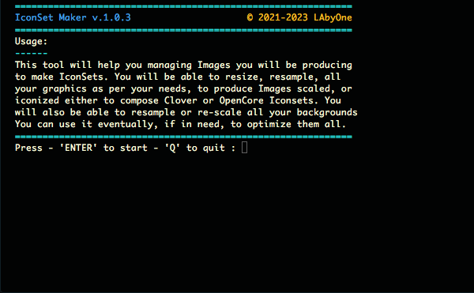
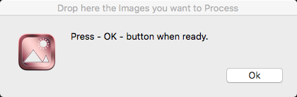
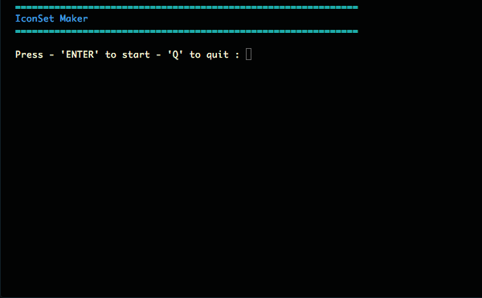
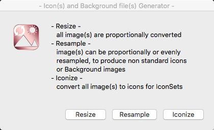
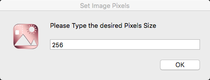
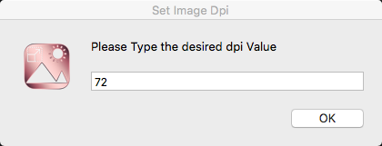
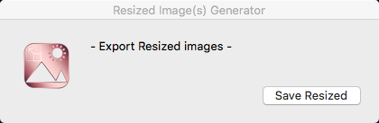
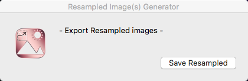
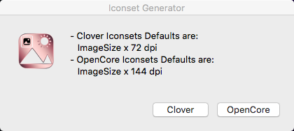

# IconSet Maker
Graphic tool i made to automate resizing single or multiple images, and creation of IconSets for Clover or OpenCore BootLoaders

Those like me incline to design their own themes will sure find it very handly 

#

#

#

#

#

#

#

#
[Download](https://github.com/LAbyOneUk/IconSet-Maker/releases)
